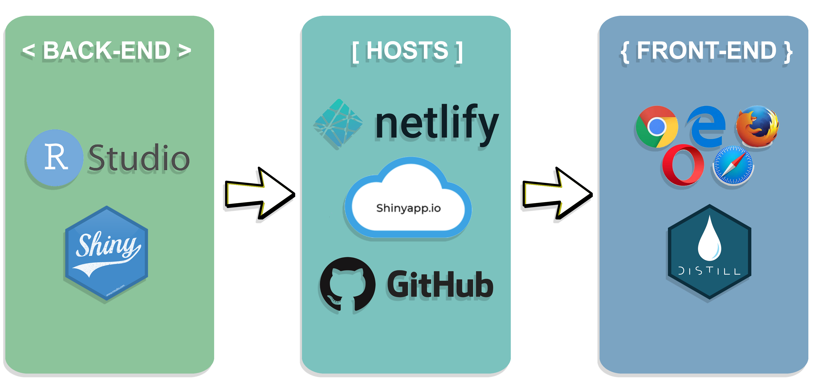

```{r setup, include=FALSE}
knitr::opts_chunk$set(echo = FALSE)
```

# Problem & Motivation

Countless data sources exist in the form of spatial data, with geographic elements such as the shape, size or location of the features. Such spatial data could be analysed to generate useful insights or drive insightful decisions such as planning locations of facilities and understanding more about Ecology.

However, not many people are technically trained to do such spatial analysis. Additionally, the only way for them to improve their breadth and depth of knowledge pertaining to this area is limited to online resources. Without proper foundation, any analysis done could be highly inaccurate as well.

**Therefore, our main focus is to develop a web-based geospatial analytical tool dedicated to Point Pattern Analysis (PPA), with two methods available for use.**

Through this geospatial application, we hope to give pointers to and allow users to conduct PPA for their selected data with ease, regardless of their technical background. 

# Approach

## **Data Collection**

We collated several data sets to be used as sample use cases for our application, such as the **locations of McDonalds' outlets in Singapore** and **MRT Stations in Punggol, Singapore**. The wide range of data consists of both CSV and Shapefile formats.

## **Data Wrangling**

We checked through the respective data sets and ran Exploratory Data Analysis (EDA) with them to check for any outliers and anomalies in the data. 
The relevant checks were then done with the help of various R packages, such as **ensuring the imported objects have the correct Coordinate Reference System (CRS) information** with *spTransform()* and **confining the data to the study area** through an *owin* object.


## **Application Architecture**

```{r, out.width='70%', fig.align="center"}

```

# Overview of Spatial Pointers

```{r, out.width='70%', fig.align="center"}

```

Our design for our application closely follows a standardized layout for the various tabs: a main visualization panel on the left and a side panel for selection of inputs on the right. With this layout, it allows users to get a quick overview of the chosen tab at one glance.

**1. Home Page**

```{r, out.width='100%', fig.align="center"}
knitr::include_graphics("Images/App 1.png")
```

From this Home Page, you can have a quick overview of the motivation behind our application, what our application is all about and also gain a quick understanding of what Point Pattern Analysis can do for you.

**2. Spatial Point Patterns Analysis (SPPA)**

```{r, out.width='100%', fig.align="center"}

```

The SPPA page is the second page that you can access in our application with **four sub tabs** made available for use: *1) SPPA Kernel Density Estimation, 2)	SPPA G-Function, 3)	SPPA F-Function, 4)	SPPA Cross L-Function .*

**3. Network Constrained Spatial Point Patterns Analysis (NetSPPA)**

```{r, out.width='100%', fig.align="center"}

```

The NetSPPA page is the third page that you can access in our application with **three sub tabs** made available for use: *1)	NetSPPA Kernel Density Estimation, 2)	NetSPPA K-Function, 3)	NetSPPA Cross K-Function .* 

**4. Data Import**

The Data Import page is the fourth page that you can access in our application. This tab allows users to import their data in shapefile format. 

# Future Work

Further improvements could be made to the application, such as:

**1. Enabling a more generic Data Import function**

Currently, our application only accepts data uploaded in shapefile format, which could be limiting for certain use cases. 

**2. Add additional PPA methods into the application**
Additional point pattern analysis methods can be added to further enhance the application’s capabilities. 

**3. Integrating with real-time databases**

Our application could be integrated with real-time databases to provide more substantial demonstrations for users. 

# Conclusion

We designed the application in a way that is **user-friendly**, and offer users the simplest explanations possible to make map/graph results easy to interpret and understand.  The application allows users to perform SPPA and NetSPPA with ease, serving as an effective exploratory tool for all users.

Accessibility wise, Spatial Pointers is an open-source web-based tool and is **freely available** to all users from across the globe.

To sum it all up, Spatial Pointers was created to address the lack of existing effective PPA oriented applications. We hope our application can be helpful for researchers to do PPA analysis.

```{r, include=FALSE}
knitr::write_bib(c('knitr','rmarkdown','posterdown','pagedown'), 'packages.bib')
```
