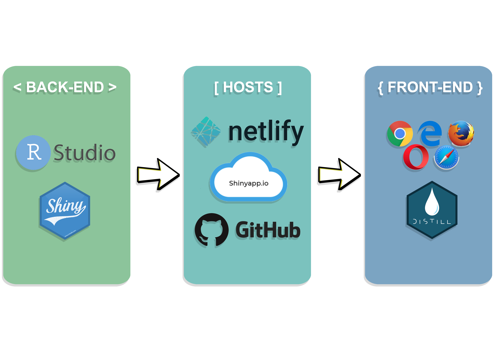

# 1. Theme: **Point Pattern Analysis**

# 2. Abstract
To help bridge the gap between geospatial analysis and ease of use, Spatial Pointers is created to aid non-technical users with a specific type of geospatial analysis: Point Pattern Analysis. 

Our application will assist users with two kinds of Point Pattern Analysis: Spatial Point Patterns Analysis and Network-Constrained Point Patterns Analysis. Spatial Point Patterns Analysis is helpful in finding out whether the input dataset point distribution resembles spatial randomness or regular/clustered pattern; or whether two input dataset point distributions are dependent on each other. Network-Constrained Point Patterns Analysis is helpful in finding out whether the distribution of spatial point events occurring on or alongside networks resembles spatial randomness or regular/clustered pattern. 

For each analysis, our application is able to provide users with kernel density maps of the input spatial point datasets and conduct various hypothesis tests to derive statistical conclusions on the distributions of datasets.

To illustrate the functions of our application, we will input examples for the two types of analysis. For Spatial Point Patterns Analysis, we would like to uncover whether McDonald’s outlets in Singapore are distributed randomly and if not, what are the factors that affect the outlets’ location. For Network-Constrained Point Patterns Analysis, we inputted data sets of various point events (e.g. Childcare Centres) in Punggol, Singapore and several chosen secondary factors in the same study area. Through this, we can investigate whether the point events (e.g. Childcare Centres) in Punggol, Singapore is distributed randomly and if not, what are the secondary factors (e.g. Bus Stops) that affect their locations.

# 3. Problem & Motivation
Countless data sources exist in the form of spatial data, with geographic elements such as the shape, size or location of the features. Such spatial data could be analysed to generate useful insights or drive insightful decisions such as [planning locations of facilities](https://www.esri.com/arcgis-blog/products/product/analytics/the-power-of-where-how-spatial-analysis-leads-to-insight/) and [understanding more about Ecology](https://ecologicalprocesses.springeropen.com/articles/10.1186/s13717-021-00314-4). 

However, not many people are technically trained to do such spatial analysis. Additionally, the only way for them to improve their breadth and depth of knowledge pertaining to this area is limited to online resources. Without proper foundation, any analysis done could be highly inaccurate as well.  

Therefore, our main focus is to develop a web-based geospatial analytical tool dedicated to **Point Pattern Analysis**, with two methods available for use.

Through this geospatial application, we hope to give pointers to and allow users to conduct Point Pattern Analysis for their selected data with ease, regardless of their technical background. Hence, the name Spatial Pointers is given for our application. 

# 4. Project Objectives
In this project, we would like to create an analytical application that enables users to:

* Better understand the capabilities and use cases of Point Pattern Analysis
* Conduct Spatial Point Patterns Analysis (Kernel density estimation and G/F/Cross-L functions)
* Conduct Network-Constrained Point Patterns Analysis (Point density estimation and K/Cross-K functions)
* Use insights derived from the analysis for better decision making

# 5. Main Features
The main features of the analytical tools are:

**a. Spatial Point Patterns Analysis**

  * Filters
    + Different Variables for Analysis
    + Various Bandwidth Selection Methods
    + Various Kernel Methods
    + Various Statistical Functions
  * Sliders
    + For Fixed Bandwidth Selection Method
    + Number of Simulations
    
**b. Network-Constrained Point Patterns Analysis**

  * Filters
    + Various Kernel Methods
    + NKDE Calculation Methods
  * Sliders
    + Number of Simulations
    + Input Data Function
    + Fixed Data Structure
    + Graph Interpretation Function
    + Helps Interpret Results

# 6. Data Sources
The following datasets will be used as sample use cases:

**Spatial Point Patterns Analysis**

* [McDonald's in Singapore](https://www.mcdonalds.com.sg/locate-us/)
* [Gyms in Singapore](https://data.gov.sg/dataset/gymssg)
* [Community Clubs in Singapore](https://data.gov.sg/dataset/community-clubs)
* [MRT Stations in Singapore](https://data.gov.sg/dataset/master-plan-2019-rail-station-layer)
* [KFCs in Singapore](https://www.kfc.com.sg/Location/Search)

**Network-Constrained Point Patterns Analysis**

* Road Network of Punggol, Singapore (Taken from Professor Kam Tin Seong from a previous Hands-on Exercise)
* Location of Childcare Centres in Punggol, Singapore (Taken from Professor Kam Tin Seong from a previous Hands-on Exercise)
* [Location of Bus Stops](https://datamall.lta.gov.sg/content/datamall/en.html)
* [MRT/LRT Stations](https://datamall.lta.gov.sg/content/datamall/en.html)
* Schools in Punggol, Singapore (Manually Complied from Google)

# 7. Approach/Methodology

**a. Data Preparation**

  + Assemble data from various sources
  + Importing in data
  + Data Wrangling
  
**b. Exploratory Data Analysis (EDA)**

  + Examine distribution of data points
  + Check for outliers and anomalies in data
  + Data Wrangling (if necessary) 
  
**c. Point Pattern Analysis**

  * Spatial Point Patterns Analysis:  First-order and Second-order analysis
    + Kernel Density Estimation: Visualise and explore the intensity of points
    + G-Function and F-Function: Reveal whether points resemble clustered pattern, regular pattern or are distributed randomly
    + Cross K-Function and Cross L-Function: Uncover whether target point locations are dependent on other points’ locations
  * Network Constrained Spatial Point Patterns Analysis:  First-order and Second-order analysis
    + Network Constrained Kernel Density Estimation: Estimate the average density of points along a network
    + Second-Order Network Constrained K-Function (Network Constrained Ripley's K-Function): Reveal whether point patterns are dispersed, clustered or randomly distributed 
    + Correlation in Multitype Point Patterns Using Network Constrained Cross K-Function: Uncover whether locations of point patterns are affected by another type of point patterns (e.g. Location of Airbnb listings affected by location of MRT stations)
    
# 8. Literature review
## a. [A Shiny web application for the analysis of spatial and spatio-temporal disease data](https://doi.org/10.1016/j.sste.2017.08.001)

* Summary:
  + SpatialEpiApp is a Shiny web application that integrates two of the most common approaches in health surveillance: disease mapping and detection of clusters. SpatialEpiApp is created for ease of use and does not require any programming knowledge.
* Learning Points:
  + SpatialEpiApp has an “Inputs” page that allows users to upload their data and select their choice of analysis, drop down menu is provided for users to map the correct columns to the fixed data structure of the application
  + There is a feature that allows users to download the results of their data analysis, which is good for users
* Linking back to our project:
  + We’ll set a proper data structure to ensure users are able to input their data correctly for analysis 
  + We could possibly create a “Download Report” feature for users too, but further research is necessary to do so, and after we’ll evaluate the feasibility of such a feature on our application

## b. [Measuring Spatial Patterns of Health Care Facilities and Their Relationships with Hypertension Inpatients in a Network-Constrained Urban System](https://doi.org/10.3390/ijerph16173204)

* Summary:
  + NetKDE was applied to detect health care service hot spots, and the network Cross K-function method was applied to measure various spatial clustering pattern relationships along the road network.
* Learning Points:
  + The study cited previous studies, which has indicated that the choice of the kernel function is less important than the choice of search bandwidth. Thus, various bandwidths were experimented before settling on a chosen value.
  + Lesser data points may not necessarily mean weaker clustering relationships. Although the number of hospitals was relatively small compared to the other factors, the analysis showed that hospitals had the strongest clustering pattern relationship with hypertension inpatients along the road network. 
* Linking back to our project:
  + We will provide users with various values of bandwidths so as to allow them to choose the appropriate one for their analysis
  + There will be a feature that helps users to interpret the results of their statistical tests and functions

## c. [Spatial Point Pattern Analysis of Human Settlements and Geographical Associations in Eastern Coastal China — A Case Study](https://www.mdpi.com/1660-4601/11/3/2818/htm)

* Summary:
  + Ripley’s K function and Monte Carlo simulation were used to investigate human  settlement  point  patterns in the Wen-Tai region of eastern coastal China.
  + Remotely sensed  tools  and  regression  models  were  also employed to identify the effects of geographical determinants on the targeted settlement locations.
* Learning Points:
  + K function was used effectively to point out the relevant spatial patterns
  + The study used regression models to analyse the determinants of the spatial point patterns, which is something our group could look at, but depending on how relevant it would be to our project focus
* Linking back to our project:
  + As a complementary to Ripley’s K function, we will also use K/L-cross function as well to analyse the determinants because it is specifically targeted for bivariate analysis

# 9. Storyboard

## Home Page

## Spatial KDE

## Spatial Statistical Functions 

## Network KDE

## Network Statistical Functions 

## Data

# 10. Application Architecture

# 11. [Timeline](https://sharing.clickup.com/g/h/ram05-145/0cd9f0ec9bd0cdf)

Click the above heading to access our timeline page for more details about how the workload is split.

